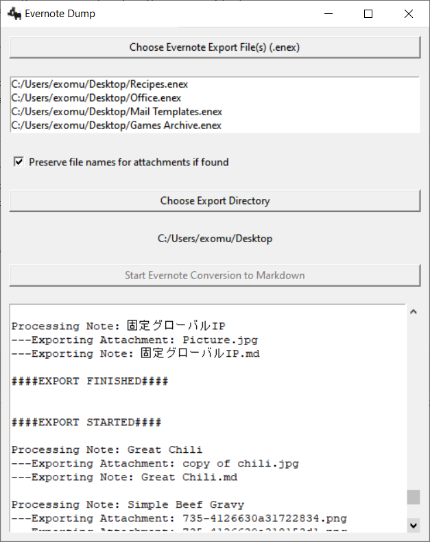
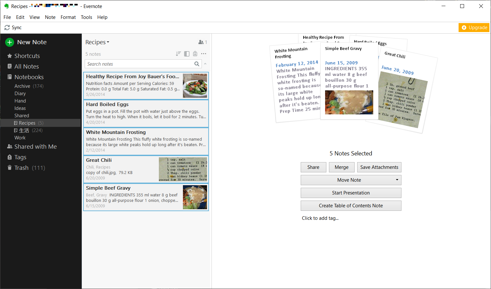
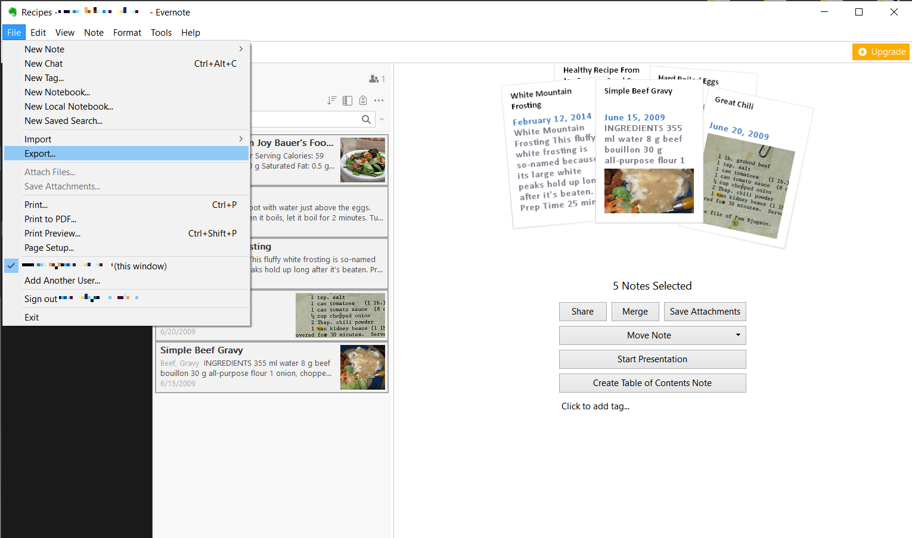
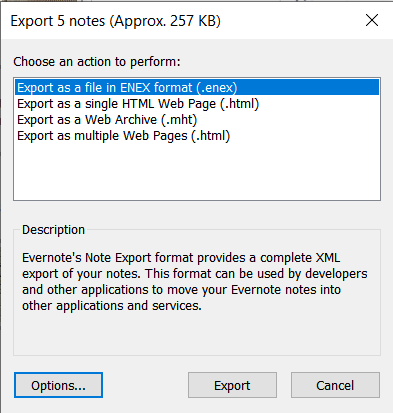

# Evernote Dump

**Evernote Dump** exports and extracts Evernote notes and attachments from .enex files.

All notes and attachments will keep their original file created and accessed dates. Notes will be converted to markdown format. Tags and other embedded information will be formatted and added to the end of each note.

Evernote Dump works by streaming the .enex file through a parser so even extremely large .enex files _should_ work.



## Requirements 

```
pip install -r requirements.txt
```

## Running: GUI

```
python evernote_dump.py
```

## Running: Command Line

```
# For a full list of commands
python evernote_dump.py -h

# Dump to current directory
python evernote_dump.py FILE.enex

# Batch dump
python evernote_dump.py *
```
A folder will be created for each 'enex' file and the notes and media will be saved in that folder.

## Exporting Notes from Evernote

### Step 1:

Download [Evernote Desktop](https://evernote.com/download), install the desktop client, and log-in.

### Step 2:

Select which Notebook you want to export or All Notes. Select one of the notes and on the menu bar choose [Edit] >> [Select All].

I recommending exporting each Evernote Notebook individually to keep your note structure.

Evernote Dump can handle multiple files at the same time and export each file to its own folder.



### Step 3:

Select [File] >> [Export] from the menu bar.



### Step 4:

Make sure "Export as a file in ENEX format (.enex)" is selected and click [Export] and choose a directory for exporting.



You are now ready to run **Evernote Dump**.

## Evernote Enex File Map

```xml
<?xml version="1.0" encoding="UTF-8"?>
<!DOCTYPE en-export SYSTEM "http://xml.evernote.com/pub/evernote-export3.dtd">
<en-export export-date="20130730T205637Z" application="Evernote" version="Evernote Mac">
    <note>
        <title>Test Note for Export</title>
        <content>
            <![CDATA[<?xml version="1.0" encoding="UTF-8" standalone="no"?>
            <!DOCTYPE en-note SYSTEM "http://xml.evernote.com/pub/enml2.dtd">
            <en-note style="word-wrap: break-word; -webkit-nbsp-mode: space; -webkit-line-break: after-white-space;">
                Hello, World.
                <div>
                    <br/>
                </div>
                <div>
                    <en-media alt="" type="image/jpeg" hash="dd7b6d285d09ec054e8cd6a3814ce093"/>
                </div>
            </en-note>
            ]]>
        </content>
        <created>20130730T205204Z</created>
        <updated>20130730T205624Z</updated>
        <tag>fake-tag</tag>
        <note-attributes>
            <latitude>33.88394692352314</latitude>
            <longitude>-117.9191355110099</longitude>
            <altitude>96</altitude>
            <author>exomut</author>
        </note-attributes>
        <resource>
            <data encoding="base64">/9j/4AAQSkZJRgABAQAAAQABAAD/4gxYSUNDX1BST0ZJTEUAAQEAAAxITGlubwIQAABtbnRyUkdCIFhZ
            WiAHzgACAAkABgAxAABhY3NwTVNGVAAAAABJRUMgc1JHQgAAAAAAAAAAAAAAAAAA9tYAAQAAAADTLUhQ
            <!-- ... -->
            kfeIGT/+uufk8DpM0gyVjGfmzkgetesnUoTHJ+5Cxn86zmv4/wB75EW+QHAPUH/P9Ky+s1rtrr/wfvOm
            dBSamnq/xPKp/hpLKmS7x4OBjgn6elee6v4OuLJirRSHb/FtyG9s9u1fR0+oTiIRvGq7W4bpisfUGk1C
            GVWtkIyM57n1rfDY+uqigtU76ffZkUsA6iajHZ6v/P8A4B//2Q==</data>
            <mime>image/jpeg</mime>
            <width>1280</width>
            <height>720</height>
            <resource-attributes>
                <file-name>snapshot-DAE9FC15-88E3-46CF-B744-DA9B1B56EB57.jpg</file-name>
				<source-url>www.google.com</source-url>
            	<latitude>33.88394692352314</latitude>
            	<longitude>-117.9191355110099</longitude>
            	<altitude>96</altitude>
				<camera-make>Sharp</camera-make>
				<camera-model>23</camera-model>
				<attachment>true</attachment> #DOUBLE CHECK
				<application-data>Developer place 4K</application-data>

            </resource-attributes>
        </resource>
    </note>
</en-export>
```
